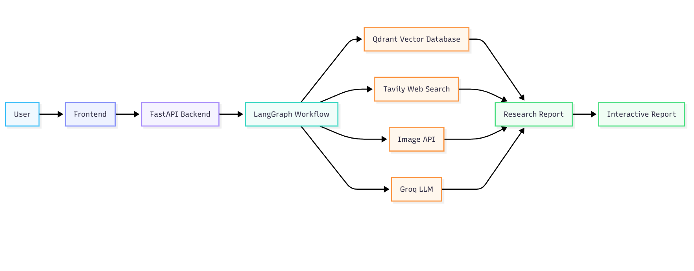
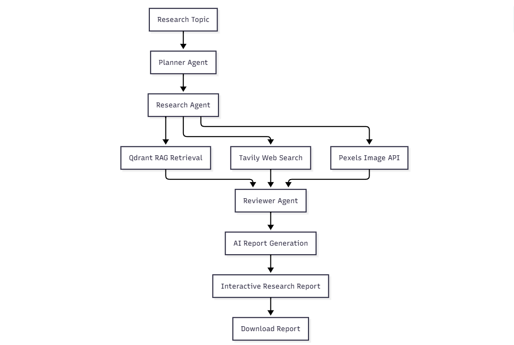
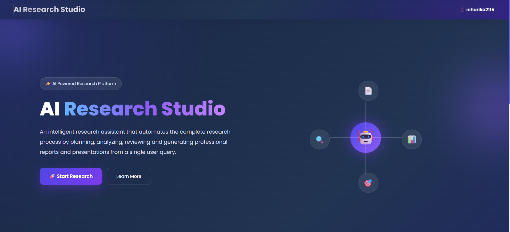
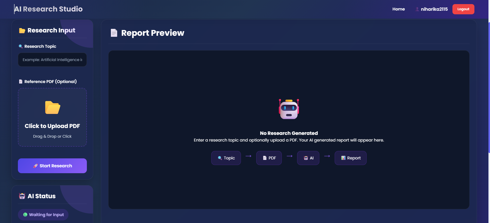
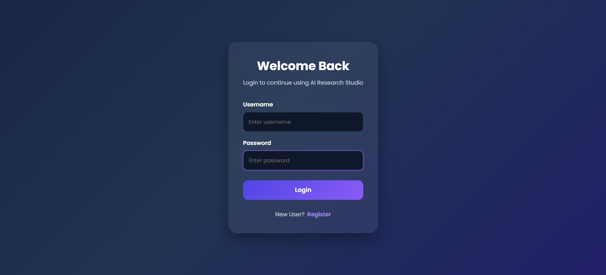
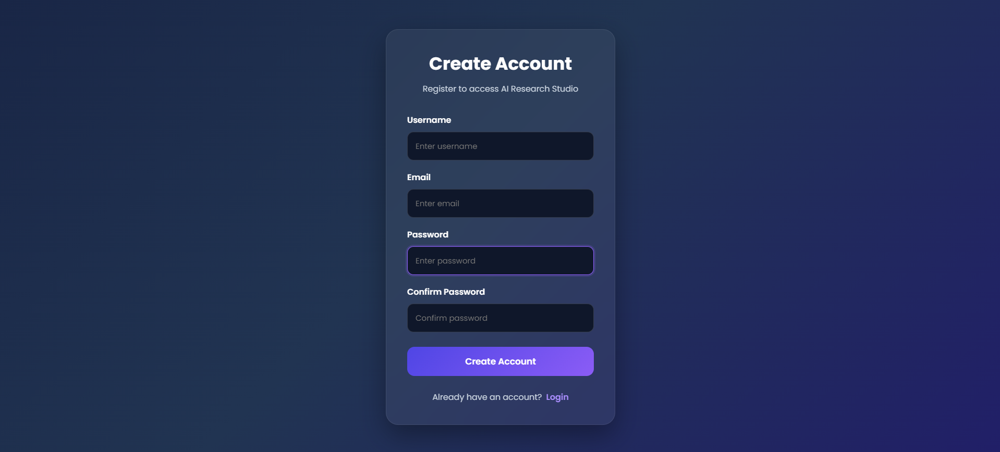
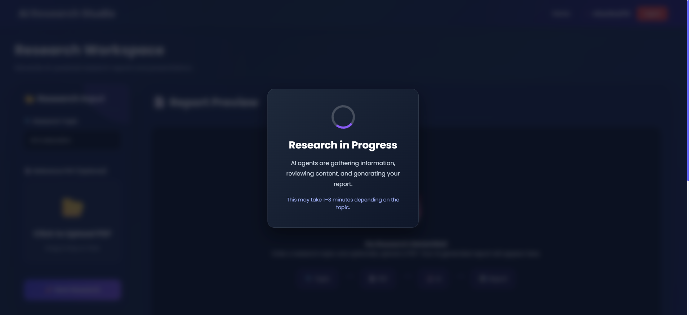
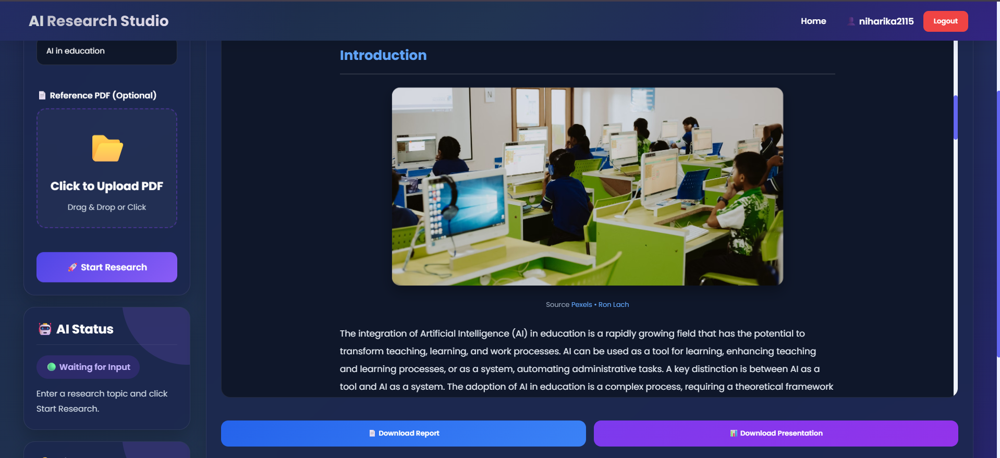
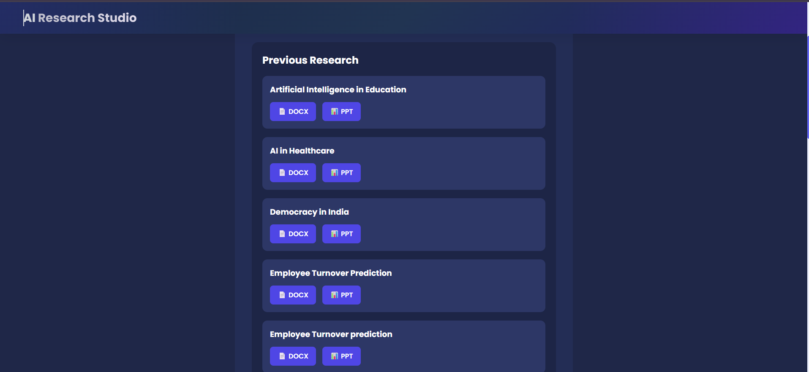

<div align="center">

# 🔬 AI Research Studio

### *An AI-powered research assistant that integrates Retrieval-Augmented Generation (RAG), semantic vector search, live web search, and Large Language Models to generate accurate, citation-based research reports.*

<p>


</p>

</div>

---

# 📖 Overview

AI Research Studio is a full-stack AI-powered research platform that streamlines the research process using an intelligent multi-agent workflow. By combining **Retrieval-Augmented Generation (RAG)**, **semantic vector search**, **live web search**, and **Large Language Models (LLMs)**, the application generates comprehensive, citation-based research reports from both uploaded documents and real-time online sources.

The platform enables users to upload PDF documents, retrieve relevant contextual information from a vector database, enhance research with the latest information available on the web, and generate well-structured reports through an intuitive interface. Its modular architecture ensures efficient document retrieval, scalable AI workflows, and an improved research experience.

---

# ✨ Features

* 🤖 Multi-agent AI research workflow
* 📄 Upload and analyze PDF documents
* 🧠 Retrieval-Augmented Generation (RAG)
* 🔍 Semantic vector search with Qdrant
* 🌐 Live web search integration using Tavily
* 📚 AI-generated citation-based research reports
* 💬 Research history management
* 🔐 Secure user authentication
* 📥 Downloadable research reports
* ⚡ Clean and responsive user interface

---

# 🏗️ System Architecture

<p align="center">
  
</p>

---

# 🔄 Research Workflow

<p align="center">
  
</p>

---

# 🛠️ Tech Stack

| Category                | Technologies          |
| ----------------------- | --------------------- |
| **Backend**             | FastAPI, Python       |
| **AI Framework**        | LangGraph, LangChain  |
| **LLM**                 | Groq                  |
| **Vector Database**     | Qdrant                |
| **Web Search**          | Tavily                |
| **Database**            | SQLite                |
| **Authentication**      | JWT                   |
| **Document Processing** | PyPDF                 |
| **Frontend**            | React, CSS            |
| **Images**              | Pexels                |

---

# 📸 Application Preview

## 🏠 Home

<p align="center">
  
</p>

---

## 🏠 Dashboard

<p align="center">
  
</p>

---

## 🔐 Login

<p align="center">
  
</p>

---

## 📝 Register

<p align="center">
  
</p>

---

## 📄 Research Generation

<p align="center">
  
</p>

---

## 📑 Generated Research Report

<p align="center">
  
</p>

---

## 📚 Research History

<p align="center">
  
</p>

---

# ⚙️ Installation

### 1. Clone the repository

```bash
git clone https://github.com/your-username/AI-Research-Studio.git
cd AI-Research-Studio/backend
```

### 2. Create a virtual environment

```bash
python -m venv venv
```

### 3. Activate the virtual environment

**Windows**

```bash
venv\Scripts\activate
```

**macOS/Linux**

```bash
source venv/bin/activate
```

### 4. Install dependencies

```bash
pip install -r requirements.txt
```

---

# 🔑 Environment Variables

Create a `.env` file inside the **backend** directory.

```env
GROQ_API_KEY=your_api_key

TAVILY_API_KEY=your_api_key

PEXELS_API_KEY=your_api_key

QDRANT_API_KEY=your_api_key

QDRANT_URL=your_qdrant_url

SECRET_KEY=your_secret_key
```

---

# ▶️ Running the Project

Start the backend server:

```bash
uvicorn api.main:app --reload
```

Start the frontend and open the application in your browser.

```bash
npm run dev
```
---

# 📂 Project Structure

```text
AI-Research-Studio/
│
├── backend/
│   ├── agents/
│   ├── app/
│   ├── auth/
│   ├── config/
│   ├── memory/
│   ├── models/
│   ├── rag/
│   ├── tools/
│   ├── database/
│   ├── requirements.txt
│   └── workflows/
│
├── frontend/
├── screenshots/
└── README.md
```

---

# 🚀 Future Enhancements

* 📊 Interactive charts and visualizations
* 🌍 Multi-language report generation
* 🎤 Voice-enabled research assistant
* 👥 Collaborative research workspace
* 📑 Additional export formats
* 🧠 Enhanced agent capabilities

---

# 📄 License

This project is developed for educational and research purposes.
